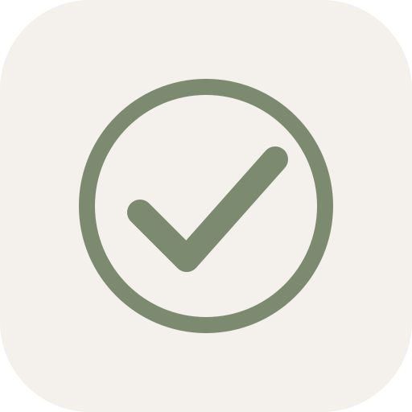

# Lugn

En lugn, minimalistisk PWA för dig som är sjukskriven och vill organisera dagen — schemalägg vad som ska göras, håll koll på medicin, och få notiser när det är dags. Allt sparas lokalt på enheten.



## Funktioner

- **Idag** — dagens aktiviteter och mediciner sorterade efter tid (otimade överst).
- **Vecka** — översikt mån–sön, en dag i taget.
- **Mediciner** — namn, dosering, dagar och tider; per dag-undantag stöds.
- **Aktiviteter** med valfri tid, anteckning, påminnelse, och **delsteg** (text eller medicin).
- **Notisklocka per delsteg** — sätt en egen tid för när delsteget ska påminnas.
- **Upprepning** — välj "Engångs" eller "Varje dag". Vid redigering frågar appen om ändringen ska gälla bara den här dagen eller alla kommande.
- **Drag-and-drop** — ändra ordning på huvudaktiviteter och på delsteg.
- **Mörkt/ljust läge** följer systeminställning. Calmt och tystet visuellt språk.
- **Offline** — Service Worker cachar appen så den fungerar utan internet efter första besöket.
- **Inget konto, inga moln, ingen tracking** — datat ligger i `localStorage` på enheten.
- **Bakgrundsnotiser (valfritt)** via en egen liten Web Push-server, se `server/`.

## Använda appen direkt

1. Öppna webbappens URL på din telefon (se [Driftsätta frontend](#driftsätta-frontend) nedan).
2. På Android Chrome: tryck på "Installera"-prompten, eller på iOS Safari: Dela → Lägg till på hemskärmen.
3. Appen körs nu i fullskärm från hemskärmen.

## Driftsätta frontend

Lugn är en statisk webbapp (HTML + CSS + JS, inga byggsteg). Vilken statisk hosting som helst funkar, så länge den är HTTPS (krävs för Service Worker och notiser).

### Alternativ A: GitHub Pages (gratis, enklast)

1. Klicka på **Use this template** eller forka detta repo till ditt eget GitHub-konto.
2. I repots **Settings → Pages**:
   - Source: `Deploy from a branch`
   - Branch: `main`, mapp `/ (root)`
3. Spara. Efter någon minut är appen tillgänglig på `https://<ditt-användarnamn>.github.io/<repo-namn>/`.

### Alternativ B: Netlify Drop

Dra-och-släpp `lugn`-mappen (utan `server/` om du vill) på [app.netlify.com/drop](https://app.netlify.com/drop). Du får direkt en HTTPS-URL.

### Alternativ C: Cloudflare Pages, Vercel, Surge, valfri statisk värd

Lugn behöver bara serveras som statiska filer från valfri rot — inga byggsteg.

## Generera ikoner (en gång)

För full installation på iOS behövs PNG-ikoner. På din dator:

1. Öppna `make-icons.html` i webbläsaren (kör appen lokalt eller dubbelklicka filen).
2. Klicka på de tre nedladdningsknapparna och spara filerna i samma mapp som `index.html`.
3. Commita och pusha.

## Bakgrundsnotiser (valfritt)

Som standard fungerar notiser bara när appen är öppen. För notiser även när telefonen är låst eller appen är stängd, driftsätt push-servern i `server/`-mappen. Se [`server/README.md`](server/README.md) för detaljer.

Sammanfattning:
1. Driftsätt servern på t.ex. Render eller Fly.io (gratis tier).
2. Notera serverns URL.
3. I appen: Inställningar → klistra in URL:en under "Push-server URL", aktivera "Bakgrundsnotiser".
4. Bevilja notistillstånd.
5. Klart — appen synkar dina kommande notiser till servern, som skickar dem vid rätt tid.

## Datastruktur

Allt finns under `localStorage`-nyckeln `lugn.v1`. Strukturen ser ut som:

```jsonc
{
  "activities": [
    {
      "id": "...",
      "title": "Morgonrutin",
      "date": "2026-05-04",
      "time": "08:00",
      "notes": "",
      "notify": false,
      "done": false,
      "subtasks": [
        { "id": "...", "title": "Borsta tänderna", "notifyAt": "07:30" },
        { "id": "...", "medId": "..." }
      ],
      "repeat": "daily",
      "seriesId": "...",
      "exceptions": [],
      "instanceData": { "2026-05-04": { "done": true, "subtaskDone": { "...": true } } },
      "seriesEnd": null,
      "order": 480
    }
  ],
  "medications": [
    { "id": "...", "name": "Sertralin", "dosage": "50 mg", "days": [], "times": ["08:00"], "notify": false, "exceptions": [] }
  ],
  "medLog": { "<medId>": { "2026-05-04::08:00": "<ISO timestamp>" } },
  "settings": {
    "notificationsEnabled": false,
    "pushEnabled": false,
    "pushBackend": "",
    "pushSubscriptionId": ""
  }
}
```

Du kan exportera all data som JSON via Inställningar → Exportera data.

## Licens

MIT — gör vad du vill, men ingen garanti.
